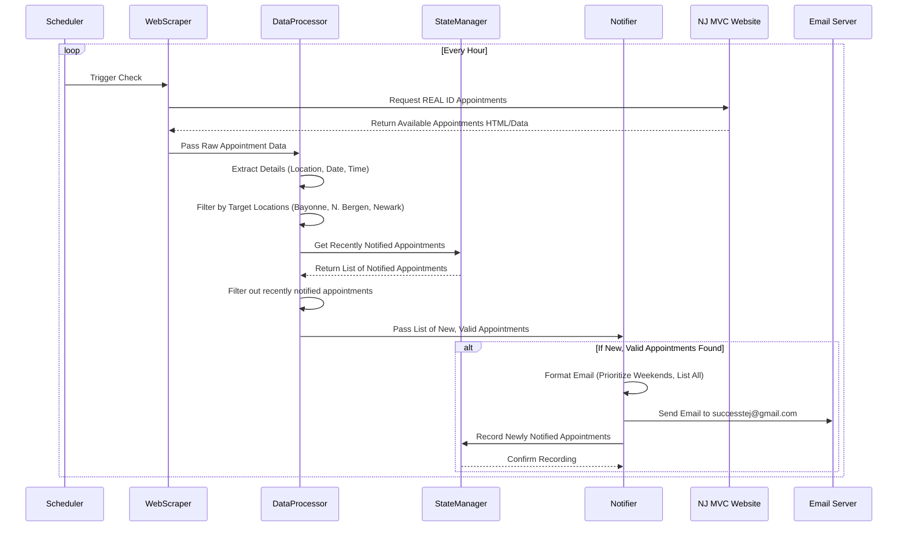

# Detailed Plan: NJ MVC Appointment Tracker

**1. Configuration:**

*   **Target Locations:** Predefined list:
    *   Bayonne MVC Agency
    *   North Bergen MVC Agency
    *   Newark MVC Agency
*   **Target Email:** `successtej@gmail.com`
*   **Check Interval:** 1 hour (60 minutes)
*   **Target URL:** `https://telegov.njportal.com/njmvc/AppointmentWizard/12`
*   **Appointment Type:** REAL ID
*   **Notification Cooldown (Recommended):** 12 or 24 hours (to avoid repeat emails for the same slot).

**2. System Architecture & Flow:**

The agent will consist of the following main components:

*   **Scheduler:** Triggers the checking process periodically.
*   **Web Scraper:** Interacts with the NJ MVC website to fetch appointment data. (Requires implementation in Code mode).
*   **Data Processor:** Filters and analyzes the scraped data.
*   **Notifier:** Formats and sends email notifications.
*   **State Manager (Optional):** Keeps track of recently notified appointments to prevent duplicates.

**Flow Diagram (Mermaid Sequence):**

**3. Functional Breakdown:**

*   **(Scheduler):** Use a library like `schedule` in Python or a system mechanism (like cron) to run the main check function every 60 minutes.
*   **(Web Scraper - To be built in Code Mode):**
    *   Needs to handle potential website structure changes gracefully.
    *   Must simulate the selection of "REAL ID" appointments.
    *   Extract location names, dates, and times accurately. Error handling for failed connections or unexpected page content is crucial.
*   **(Data Processor):**
    *   Normalize location names extracted from the site to match the configured list (e.g., "BAYONNE AGENCY" vs "Bayonne MVC Agency").
    *   Parse dates and times into a standard format.
    *   Implement filtering logic based on the location list.
    *   Implement logic to check against the State Manager's list of recently notified appointments.
*   **(Notifier):**
    *   Format the email clearly, listing all found valid appointments.
    *   If weekend appointments are present, list them first or highlight them.
    *   Include Location, Date, Time, and the direct MVC link (`https://telegov.njportal.com/njmvc/AppointmentWizard/12`) for each appointment.
    *   Use standard email protocols (SMTP) to send the email via a configured email account (requires credentials/setup, potentially using environment variables for security).
*   **(State Manager - Optional):**
    *   Store tuples of (Location, Date, Time, NotificationTimestamp).
    *   Provide a function to check if a specific appointment (Location, Date, Time) has been notified within the cooldown period.
    *   Provide a function to add newly notified appointments.
    *   Periodically prune old entries beyond the cooldown period. This could be a simple in-memory dictionary or a small file/database for persistence across restarts.

**4. Implementation Notes (for Code Mode):**

*   **Language:** Python is well-suited due to libraries for scheduling (`schedule`), web scraping (`requests`, `beautifulsoup4`, or potentially `selenium`/`playwright` if JavaScript interaction is needed), and email (`smtplib`, `email`).
*   **Environment:** Need to manage dependencies (e.g., using `requirements.txt` or `pyproject.toml`). Secure handling of email credentials is vital (e.g., environment variables, `.env` file).
*   **Error Handling:** Robust error handling for network issues, website changes, and email sending failures. Logging would be beneficial.